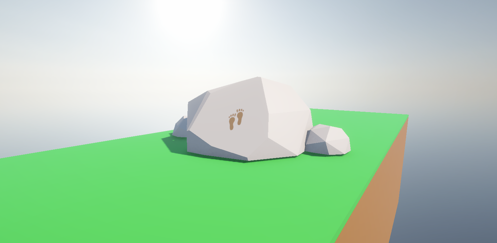
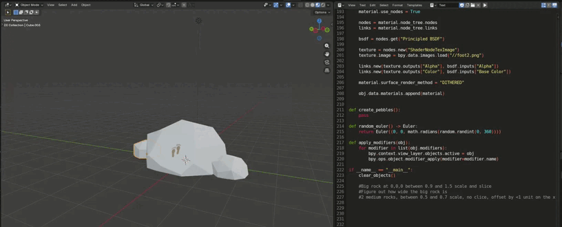

# Random Rock
Random rock is a small blender addon developed in python for quickly generating slightly altered rock structures. This project was used for learning blender and the blender python API. The asset itself is a draft of a 3d model required for the game _**sticker slap**!_ (a project in progress)

## Script
The script generates the rocks using the `subdivision`, `displace` (with a `voronoi` texture) and `decimate` modifiers. The large rock is bisected at a specific angle to create a slanted slope. A footprint texture is then mapped onto the slanted surface. 

## Installation

The easiest way to install the addon is by downloading `randomrock.zip` and dragging it into the addons folder.

1. Download `randomrock.zip` from the root of the repository
2. In blender, navigate to `Edit` -> `Preferences` -> `Add-ons`
3. Drag `randomrock.zip` from your filesystem into the Addons window.

4. Locate the tool by pressing `n` to open the sidebar, and navigating to **My Tools**

## Future Improvements
- Randomised geometry
- Pebbles and/or more rock clusters to create a full rock formation